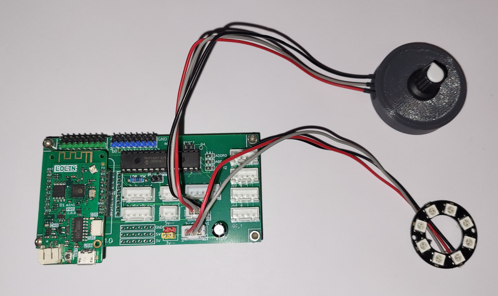
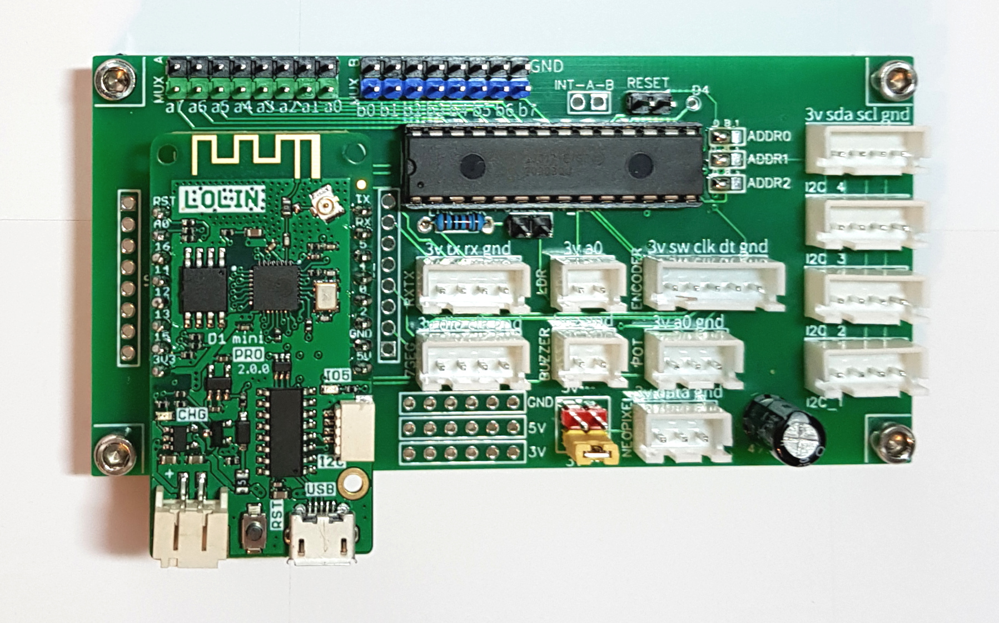
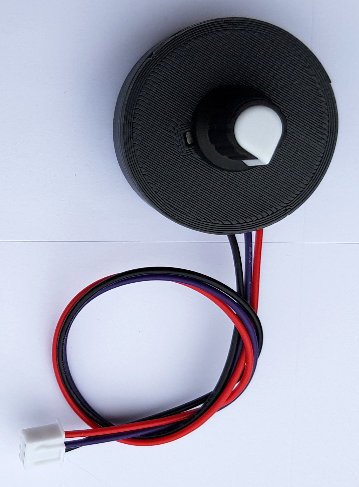
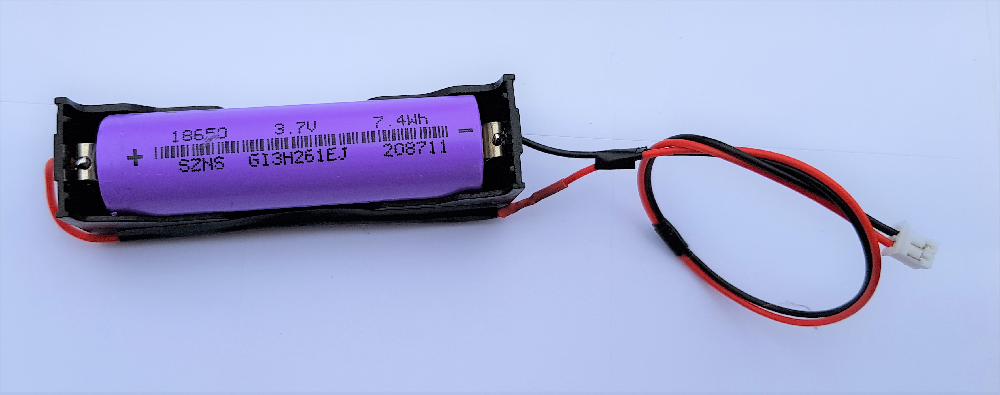
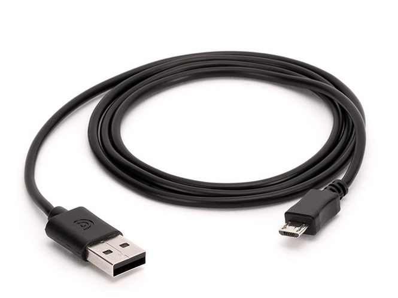
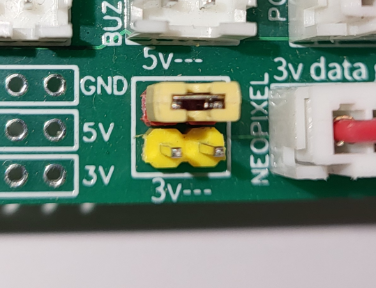
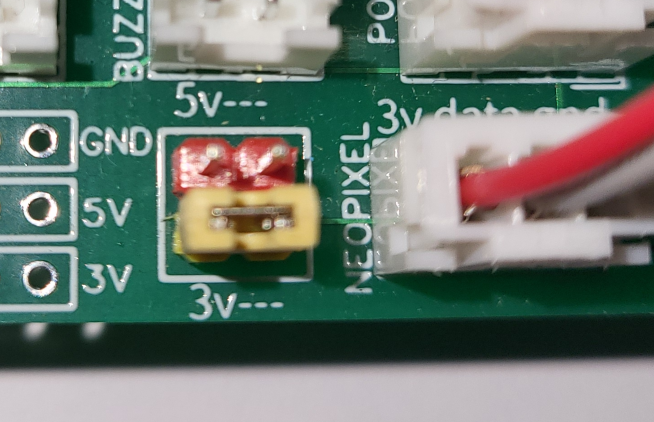
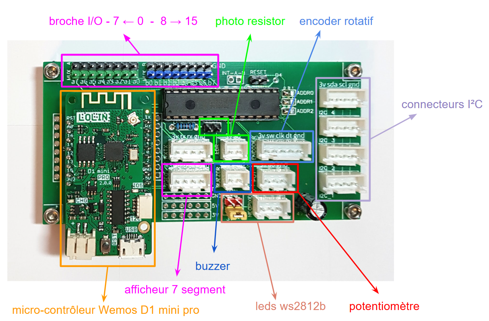
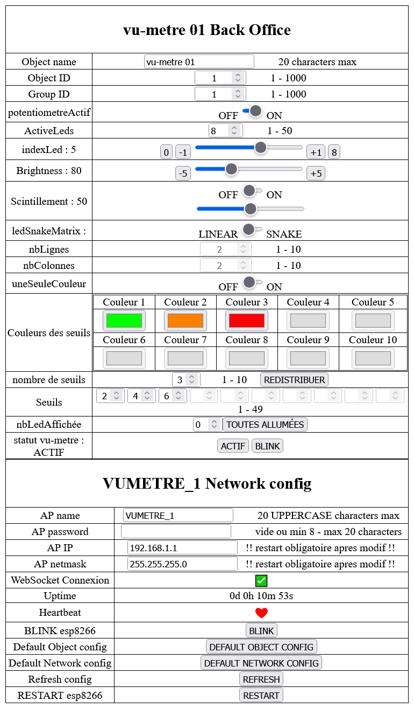

# VU-mètre
Cet objet est basé sur le kit technoLARP. Il permet d'allumer un nombre plus ou moins important de led multicolores grâce à un potentiomètre ou via un navigateur web accessible via le wifi. Le nombre de leds, les couleurs et les seuils de changement de couleur sont configurables.

- Le VU-mètre permet de simuler une jauge lumineuse grâce à des leds RGB multicolores (modèle WS2812b). 
- Le potentiomètre est optionnel, il permet d’allumer plus ou moins de led. Tourner le potentiomètre vers la droite ou la gauche pour allumer et éteindre les leds.
- Les leds peuvent aussi être contrôlées via un back office accessible un navigateur web. Pour y accéder, voir la section [Accès au webUI](#Accès au webUI)
- Il est possible de définir plusieurs seuils qui correspondent à des couleurs différentes. Par exemple, les 2 premières led s’affichent en vert, les les 2 leds suivantes en jaune et les 4 dernières leds en rouge

**[Exemples](#Exemples)**  
**[Composants](#Composants)**  
**[Branchements](#Branchements)**  
**[BackOffice](#BackOffice)**  

## Exemples

## Composants
Vous aurez besoin pour monter le VU-mètre

|  | |
| :---------------- | :------: |
| Un kit technoLarp |  |
| Un potentiomètre 10 000 Ohms |  |
| Un ruban ou d’un anneau de led ws2812b ou neopixel |  |
| Une batterie 18650 et son support |  |
| Un câble micro-USB |  |

## Branchements

1. Connecter le potentimètre sur le connecteur "POT" en rouge sur le schéma
1. Connecter les leds RGB sur le connecteur "LEDS" en orange sur le schéma

1. A côté du connecteur "LEDS", positionner le cavalier sur la position 3.3V ou 5V
    1. Si le kit sera alimenté par un câble USB, positionner le cavalier en 5V   
    1. Si le kit sera alimenté par la batterie, positionner le cavalier en 3.3V  

## Installation

Une fois le kit technoLARP assemblé, il faut charger le programme de l'objet dans la mémoire du kit technoLARP. Ce programme s'apelle un firmware. 
Pour installer le firmware de l'objet, il faut suivre ce [tutorial](https://github.com/technolarp/technolarp.github.io/wiki/Installation-du-firmware)  

## Back Office
Le back office est une page web qui permet de gérer la configuration et d'utiliser l'objet depuis un navigateur web comme chrome ou firefox

 Pour se connecter au back office de l'objet, il faut suivre ce [tutorial](https://github.com/technolarp/technolarp.github.io/wiki/Connexion-au-back-office-de-l'objet-via-le-wifi)  

## Configuration réseau
Le module peut fonctionner avec 2 type de connexions wifi
    1. Soit en créant un réseau wifi (mode AP - Access Point)
    1. Soit en se connectant à un réseau wifi déjà existant, comme celui d'une box internet  

Cette page du [wiki](https://github.com/technolarp/technolarp.github.io/wiki/Param%C3%A8tres-R%C3%A9seau) explique comment configurer ces options

A la première utilisation, l'objet technolarp fonctionne en mode AP et crée un réseau wifi du nom de l'objet (exemple: VUMETRE_1)

