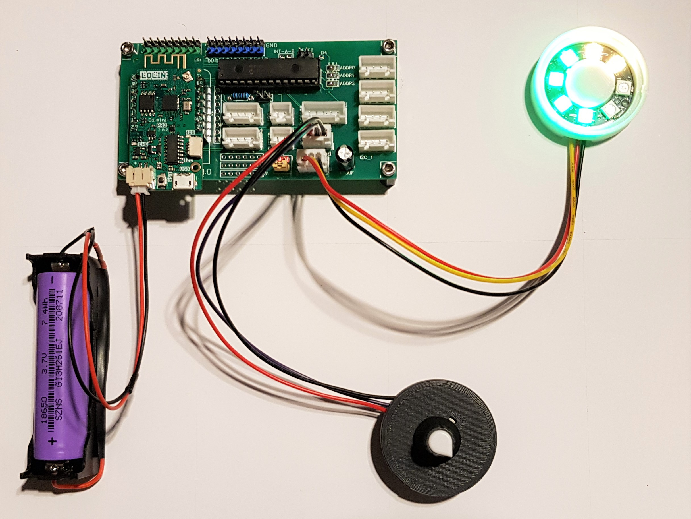

# VU-mètre
Ce montage est basé sur le kit technoLARP. Il permet de contrôler des leds multicolores à partir d'un potentiomètre ou d'un navigateur web

## Exemples

## Composants
Vous aurez besoin pour monter le VU-mètre

|  | |
| :---------------- | :------: |
| Un kit technoLarp |  |
| Un potentiomètre 10 000 Ohms |  |
| Un ruban ou d’un anneau de led ws2812b ou neopixel |  |
| Une batterie 18650 et son support |  |
| Un câble micro-USB |  |

## Installation
Pour installer le firmware de lo'bjet, il vousfaut suivree ce [tutorial](https://github.com/technolarp/vumetre_01/)  
A mettre à jour

Sur Windows
- Installation du driver CH340

Upload du firmware
- Brancher le câble micro-usb
- Démarrer chrome sur [l'url](https://technolarp.github.io/flasher)

## Back Office

autre image

  
